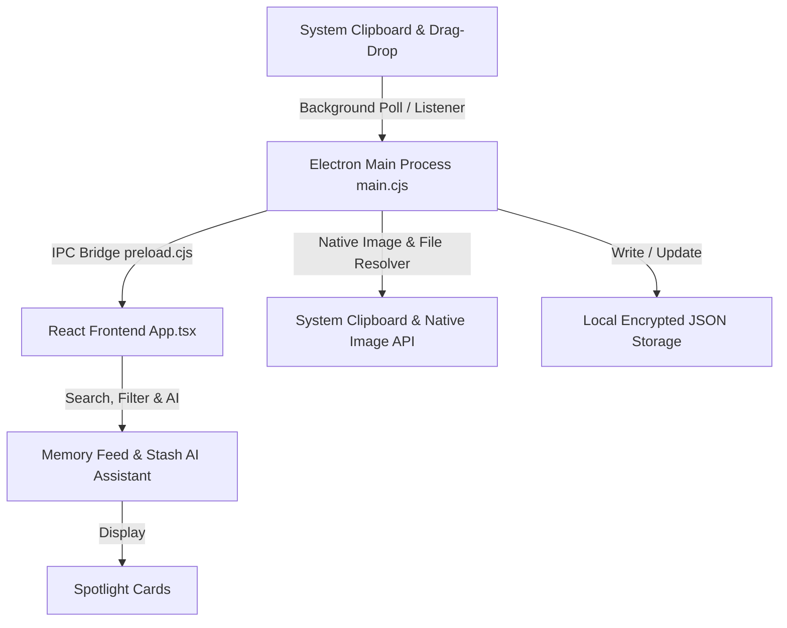

<div align="center">


# 🧠 Stash (Chat GPT for your CTRL+C)

**Your Intelligent, Local-First AI Clipboard Memory & Knowledge Vault**

[](https://electronjs.org/)
[](https://reactjs.org/)
[](https://typescriptlang.org/)
[](https://tailwindcss.com/)
[](LICENSE)

</div>

---

## 🌟 Overview

**Stash** is a modern desktop application that automatically captures, organizes, and indexes your system clipboard in real time. Designed with a privacy-first philosophy, all your clipboard history—code snippets, URLs, color codes, formatted text, secrets, and images—remains stored locally on your machine.

Featuring a **frameless glassmorphic cyberpunk UI**, curved title bar, multi-format drag-and-drop system, global hotkeys (`Alt + V`), and an offline AI assistant with multi-provider LLM support, Stash lets you instantly search, filter, retrieve, and paste anything you've ever copied.

---

## ✨ Key Features

- ⚡ **Background Clipboard Engine**: Polling process that listens for copy events across your operating system with zero latency and minimal CPU footprint.
- 🪟 **Custom Curved Glassmorphic Title Bar**: Microsoft PC Manager-inspired frameless top bar with custom Minimize, Maximize/Restore, and Close controls, plus native window dragging.
- ⌨️ **Global Shortcut (`Alt + V`)**: Press `Alt + V` anywhere on your computer to instantly summon or dismiss Stash. Includes `Alt + B` and `Alt + Space` fallback hotkeys.
- 📦 **Multi-Format Drag & Drop System**:
  - Drag highlighted text, code snippets, or URLs directly into Stash.
  - Drag text files & code files (`.txt`, `.js`, `.py`, `.json`, `.md`, `.html`, `.cpp`, `.csv`, etc.) to automatically read contents and preserve filenames.
  - Drag image files or drop images directly onto the window.
  - Animated glassmorphic Drop Zone overlay ("Release to Stash Content").
  - Drag cards out of Stash directly into external editors or apps.
- 🖼️ **Native Image Resolution & Clipboard Syncing**: Native image conversion (`nativeImage.createFromDataURL` & `nativeImage.createFromPath`) for base64 data, HTML images, and local file paths so copying image cards writes true binary image pixels directly to system clipboard.
- 🤖 **Stash AI & Multi-LLM Key Integration**: Local offline developer Q&A + optional live API keys (Groq, OpenAI, Gemini, Mistral, Grok) for instant code explanation and clipboard querying.
- 🎨 **5 Customizable Feed View Layouts**:
  - 📄 **Detailed List**: Rich card previews with code syntax highlighting and metadata.
  - 📑 **Compact List**: Ultra-dense view for scanning hundreds of clips quickly.
  - 🔳 **Detailed Grid**: Responsive card grid for visual scanning.
  - 📱 **3x3 Grid**: Balanced layout optimized for medium displays.
  - 🖥️ **4x4 Grid**: High-density grid overview for widescreen monitors.
- 🔍 **Smart Classification & Search**: Automatically categorizes clips into Code, Secrets, API Keys, URLs, SQL, Commands, Prompts, and Images with instant keyword filtering.
- 📌 **Favorites & Pinning**: Pin important snippets to the top of your feed.

---

## 🏗️ Architecture



- **Main Process (`main.cjs`)**: Manages system clipboard monitoring, IPC handlers, global shortcuts (`Alt + V`), native image creation, and window framing (`frame: false`).
- **Preload Bridge (`preload.cjs`)**: Context-bridge interface exposing safe IPC channels (`invoke`, `listen`) to the renderer.
- **Renderer (`src/App.tsx`)**: React 18 frontend styled with Tailwind CSS, custom spotlight card micro-animations, and drag-and-drop event handlers.

---

## 🛠️ Technology Stack

| Category | Technology |
| :--- | :--- |
| **Desktop Framework** | [Electron](https://www.electronjs.org/) |
| **Frontend UI** | [React 18](https://reactjs.org/) + [TypeScript](https://www.typescriptlang.org/) |
| **Styling** | [Tailwind CSS](https://tailwindcss.com/) + Custom CSS Spotlight Animations |
| **Icons** | [Lucide React](https://lucide.dev/) |
| **Bundler & Build Tool** | [Vite](https://vitejs.dev/) |
| **Packaging & Distribution**| [electron-builder](https://www.electron.build/) |

---

## 🚀 Getting Started

### Prerequisites

Ensure you have [Node.js](https://nodejs.org/) (v18 or higher) installed on your machine.

### Installation

1. **Clone the repository**:
   ```bash
   git clone https://github.com/JoyTheSloth/Stash-.git
   cd Stash-
   ```

2. **Install dependencies**:
   ```bash
   npm install
   ```

3. **Run in Development Mode (Electron + Vite HMR)**:
   ```bash
   npm run electron
   ```

4. **Build Production Executables (`.exe`)**:
   ```bash
   npm run dist
   ```
   *Generated installers and portable binaries will be saved in `release/`.*

---

## 💻 Available Scripts

- `npm run dev`: Starts the Vite dev server (web preview at `http://localhost:1420`).
- `npm run electron`: Starts Vite and launches Electron desktop app with live HMR.
- `npm run build`: Compiles TypeScript and builds production web assets.
- `npm run electron:build`: Builds production bundle and launches Electron.
- `npm run dist`: Builds standalone Windows installers & portable `.exe` in `release/`.

---

## 📄 License

This project is open-source and available under the [MIT License](LICENSE).

---

<div align="center">
  <sub>Built with ❤️ by <a href="https://github.com/JoyTheSloth">JoyTheSloth</a></sub>
</div>
