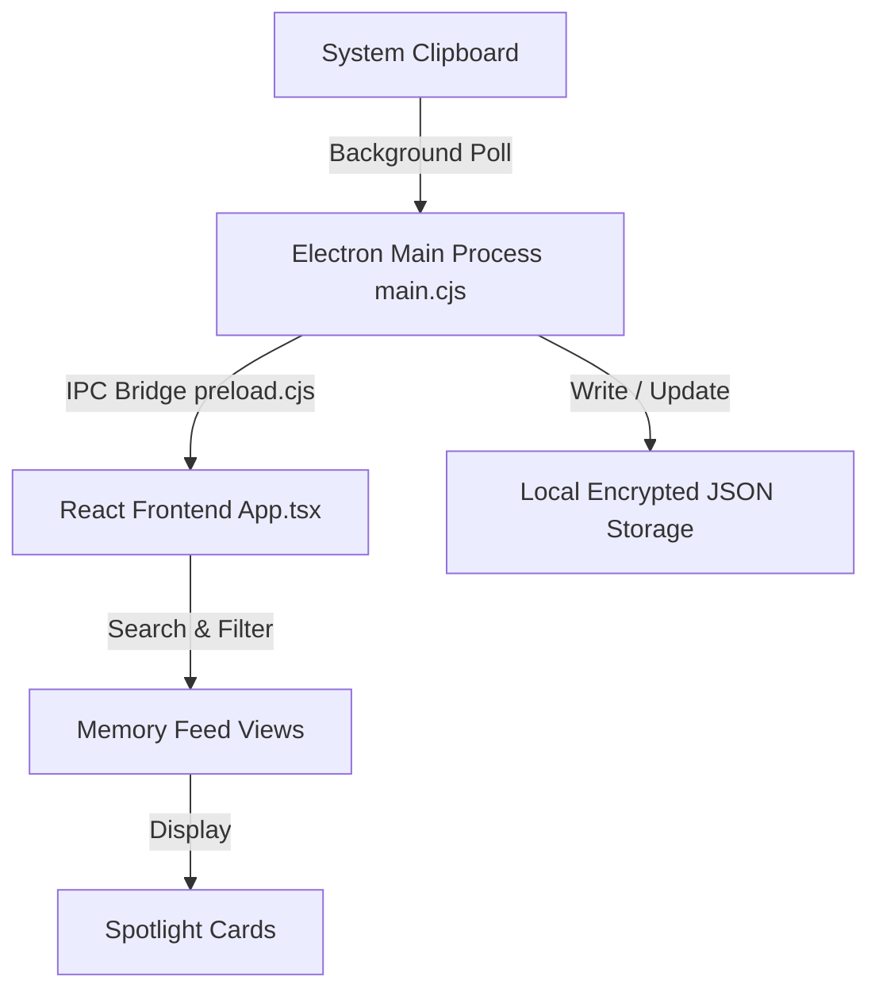

<div align="center">


# 🧠 Stash (Stash Pad)

**Your Intelligent, Local-First AI Clipboard Memory & Knowledge Vault**

[](https://electronjs.org/)
[](https://reactjs.org/)
[](https://typescriptlang.org/)
[](https://tailwindcss.com/)
[](LICENSE)

</div>

---

## 🌟 Overview

**Stash** is a modern desktop application that automatically captures, organizes, and indexes your system clipboard in real time. Designed with a privacy-first philosophy, all your clipboard history—code snippets, URLs, color codes, formatted text, and media—remains stored locally on your machine with encryption.

Featuring a **glassmorphic, dark-themed cyberpunk UI**, custom cursor spotlight effects, and **5 responsive view layout modes**, Stash lets you instantly search, filter, organize, and retrieve anything you've ever copied.

---

## ✨ Features

- ⚡ **Background Clipboard Engine**: Polling process that listens for copy events across your operating system with zero latency and minimal CPU footprint.
- 🎨 **5 Customizable Feed View Layouts**:
  - 📄 **Detailed List**: Rich card previews with code syntax highlighting and metadata.
  - 📑 **Compact List**: Ultra-dense view for scanning hundreds of clips quickly.
  - 🔳 **Detailed Grid**: Responsive card grid for visual scanning.
  - 📱 **3x3 Grid**: Balanced layout optimized for medium displays.
  - 🖥️ **4x4 Grid**: High-density grid overview for widescreen monitors.
- 🔍 **Natural & Category Filtering**: Instantly search by text or filter by categories (All, Links, Code, Text, Media, Pin/Favorites).
- 🔒 **Local-First & Encrypted**: Your data stays 100% offline. Local JSON storage protected with AES-256 for secrets.
- ✨ **Spotlight Card Micro-Animations**: Dynamic mouse-following radial glow effects on interactive cards.
- 📌 **Favorites & Pinning**: Pin important items for quick access anytime.
- ⌨️ **Keyboard Shortcuts & One-Click Copy**: Copy items back to your system clipboard instantly.

---

## 🏗️ Architecture



- **Main Process (`main.cjs`)**: Handles system clipboard monitoring, IPC handlers, window management, and native system events.
- **Preload Bridge (`preload.cjs`)**: Secure context-bridge interface exposing safe IPC channels to the renderer.
- **Renderer (`src/App.tsx`)**: React 18 frontend styled with Tailwind CSS and custom CSS spotlight effects.

---

## 🛠️ Technology Stack

| Category | Technology |
| :--- | :--- |
| **Desktop Framework** | [Electron](https://www.electronjs.org/) |
| **Frontend UI** | [React 18](https://reactjs.org/) + [TypeScript](https://www.typescriptlang.org/) |
| **Styling** | [Tailwind CSS](https://tailwindcss.com/) + Custom CSS Spotlight Animations |
| **Icons** | [Lucide React](https://lucide.dev/) |
| **Bundler & Build Tool** | [Vite](https://vitejs.dev/) |

---

## 🚀 Getting Started

### Prerequisites

Ensure you have [Node.js](https://nodejs.org/) (v18 or higher) installed on your machine.

### Installation

1. **Clone the repository**:
   ```bash
   git clone https://github.com/JoyTheSloth/Stash-.git
   cd Stash-
   ```

2. **Install dependencies**:
   ```bash
   npm install
   ```

3. **Run in Development Mode (Electron + Vite HMR)**:
   ```bash
   npm run electron
   ```

4. **Build Desktop Executable**:
   ```bash
   npm run build
   npm run electron:build
   ```

---

## 💻 Available Scripts

- `npm run dev`: Starts the Vite dev server (web-only preview at `http://localhost:1420`).
- `npm run electron`: Concurrently starts Vite and launches the Electron desktop app with live reload.
- `npm run build`: Compiles TypeScript and builds the production web bundle.
- `npm run electron:build`: Builds production assets and runs the bundled Electron app.

---

## 📄 License

This project is open-source and available under the [MIT License](LICENSE).

---

<div align="center">
  <sub>Built with ❤️ by <a href="https://github.com/JoyTheSloth">JoyTheSloth</a></sub>
</div>
